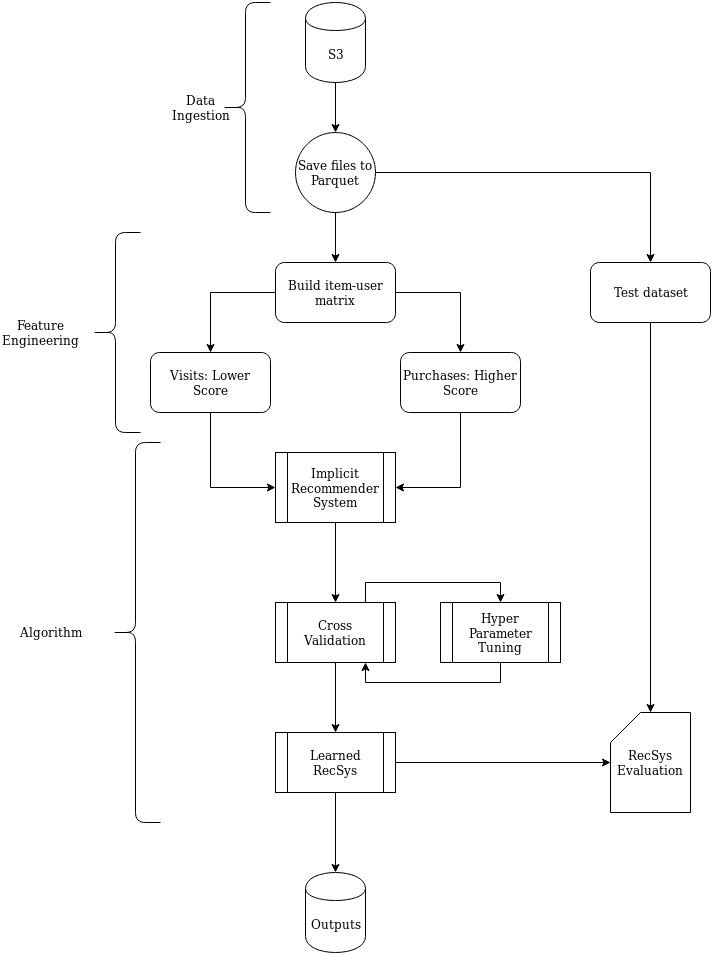

# Infrastructure

## Data ingestion

Here I describe how the data ingestion occurs on both the current setup and how it would occur in case of a POST API.

### Current Setup

Data is downloaded into the `data/` using `wget`. To replicate easily step you can simply run. 

``` bash
make download
```

Keep in mind that it downloads 1.9GB of files and then decompresses it using pixz, a parallel, indexing version of xz. So it will generate more than 26GB of files.

With the files in the local folder, and the project properly setup, conversion of the ndjson files can be ran with

```
python main.py -d
```

This step o saves them as `.parquet` files in the `data/intermediate/` folder. They are compressed using SNAPPY compression, which allows for faster decompression.

Parquet files were used as an intermediate step so the algorithm can read from it faster and portioned, which in turn allows for better scalability both out of memory or across multiple workers.

This is not parallel, so it does take a while to finish. An improvement would be to make a parallel set up for this ingestion.

### Post API

A Post API set up would be composed of 2 URLs, one for the pdpviews jsons and another for the transactions jsons. An ideal set up would be for it to be powered by Kafka, with each having its own stream processor. 

From the Kafka pipe stream it would be much easier to convert them into parquet files and save them in a HDFS to be accessed by a Hive cluster.

Another advantage from using Kafka would be scalability and speed when receiving JSONs, it would allow the data to be ingested on many nodes and to be processed by many workers.

## Distributed processing 

This project uses Spark as a way to distribute the data processing. Although no cluster was set up to make the recommendations, the process was optimized to run distributed on a single worker.

Currently everything but the decompressing of the data can be distributed on many workers. All it needs to be done is configure the spark-submit for such.

Although no memory was available at this time, with many workers it would be able to precess all of the data containing both Views and Transactions, without needing to sampling it.

## System architecture

Bellow is a flowchart describing the ideal system architecture.



* Data Ingestion: is as described previously, utilizing both 
* Feature Engineering: uses PySpark to create the user-item matrix for the recommendation. 
* Algorithm: will be discussed in more detail at the algorithm document.
* Evaluation: will be discussed in more detail at the evaluation document.
